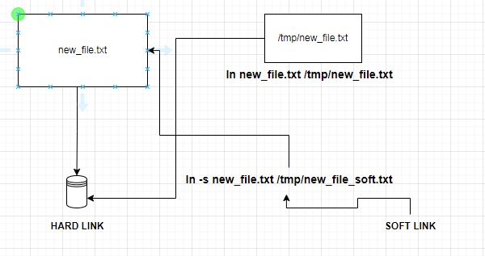

## RHEL Part-1

# Access Command Line Interface

<h2>Introduction to Bash Shell</h2>
<h3>Shell Prompt</h3>
<p>"$" in prompt shows that it is normal/regular user<br>"#" in prompt tells that shell is working with root user</p>

```bash
  [diwakar@dev ~]$
```

<u>Redhat recommeds to use default shell which is BASH</u>

<h3>Command Synatx</h3>
<p>Each command consists/may consist of three parts</p>
<ul>
  <li>Command</li>
  <li>Options (To define behaviour of Command)</li>
  <li>Arguments to feed into command</li>
</ul>

```
  bash[diwakar@dev ~]$ ls -la .
```

<ul>
  <li>Command : ls (To list files)</li>
  <li>Options : la (long list and show hidden files)</li>
  <li>Arguments : '.' (files to list in current pwd)</li>
</ul>

<h3>Execute and Write simple commands in Command Line</h3>
<p>To execute to commands : command1;command2</p>

```bash
  [diwakar@dev ~]$ whoami;uptime
  diwakar
  12:20:51 up 51 min,  2 users,  load average: 0.00, 0.00, 0.00
```

<p>Some more commands</p>

```bash
  [diwakar@dev ~]$ # date command prints system date sync with chronyd
  [diwakar@dev ~]$ date
  Sat Nov 18 12:25:26 PM EST 2023
  [diwakar@dev ~]$ date +%X
  12:25:35 PM
  [diwakar@dev ~]$ date +%R
  12:25
  [diwakar@dev ~]$ date +%r
  12:25:40 PM
  [diwakar@dev ~]$ date +%x
  11/18/2023
  [diwakar@dev ~]$ # file command uses first two bytes compiled file header to determine type
  [diwakar@dev ~]$ file .ssh
  .ssh: directory
  [diwakar@dev ~]$ file .viminfo
  .viminfo: ASCII text
```

<h3>Viewing Contents of File</h3>
<h4>Using cat to get contents of file,create and modify small files</h4>
<p>cat command helps to create,view ,modify file contents,generally for files with smaller contents</p>

```bash

[diwakar@dev ~]$ cat .bashrc
.bashrc

#Source global definitions
if [ -f /etc/bashrc ]; then
. /etc/bashrc
fi
[diwakar@dev ~]$ touch file1 file2
[diwakar@dev ~]$ echo "this is file1" >> file1
[diwakar@dev ~]$ echo "this is file2" >> file2
[diwakar@dev ~]$ cat file1 file2
this is file1
this is file2

```

<h4>Viewing page-wise display using "more "less commands</h4>
<p>Page wise display helps for longer outputs to render in pages</p>

```bash
  [diwakar@dev ~]$ # less command provides page-wise display for longer output's and UP and DOWN arrows for browsing pages
  [diwakar@dev ~]$ # using 'q' to quit
  [diwakar@dev ~]$ # wc command to count no characters(c),words(w),lines(l) occurrances in a file
  [diwakar@dev ~]$ wc -l /etc/passwd
  30 /etc/passwd
```

<h3>Tab Completion</h3>
<p>Help to finish command using TAB.ESC+. helps to finish your argument with last written argument</p>

```bash
  [diwakar@dev ~]$ # Understanding TAB Completion
  [diwakar@dev ~]$ # chmTABTAB provides list of cmd's starts with chm and chmTAB finishes command
  [diwakar@dev ~]$ chm
  chmem  chmod
  [diwakar@dev ~]$ ls /etc/pa
  pam.d/   passwd   passwd-
  [diwakar@dev ~]$ usermod --
  --add-subgids   --badnames      --del-subuids   --groups        --inactive      --move-home     --prefix        --shell
  --add-subuids   --comment       --expiredate    --help          --lock          --non-unique    --root          --uid
  --append        --del-subgids   --gid           --home          --login         --password      --selinux-user  --unlock

```

<h3>Writing long commands on multiple lines</h3>
<p>Use \ escapes the empty tab on to next line prefixed with ></p>

```bash
  [diwakar@dev ~]$ head -n3 /etc/passwd
  root:x:0:0:root:/root:/bin/bash
  bin:x:1:1:bin:/bin:/sbin/nologin
  daemon:x:2:2:daemon:/sbin:/sbin/nologin
  [diwakar@dev ~]$ tail -n3 /etc/passwd
  systemd-oom:x:984:984:systemd Userspace OOM Killer:/:/usr/sbin/nologin
  systemd-resolve:x:983:983:systemd Resolver:/:/usr/sbin/nologin
  diwakar:x:1000:1000::/home/diwakar:/bin/bash
  [diwakar@dev ~]$ tail -n3 \
  > /etc/passwd
  systemd-oom:x:984:984:systemd Userspace OOM Killer:/:/usr/sbin/nologin
  systemd-resolve:x:983:983:systemd Resolver:/:/usr/sbin/nologin
  diwakar:x:1000:1000::/home/diwakar:/bin/bash
```

<h3>Getting history of our Command Lines</h3>
<p>Viewing history or your command trail helps to track incase of debugging and troubleshooting</p>
```bash
  [diwakar@dev ~]$ # history command provides ur commands trail in shell
  [diwakar@dev ~]$ # !number finishes your command in history
  [diwakar@dev ~]$ # !string finishes your command based on your provided string
  [diwakar@dev ~]$ # !! executes you last or previously executed command
  [diwakar@dev ~]$ !!
  cat /etc/passwd
```
<h3>Navigating RHEL File System</h3>
```bash
  [diwakar@dev /]$ ls
  afs  bin  boot  dev  etc  home  lib  lib64  media  mnt  opt  proc  root  run  sbin  srv  sys  tmp  usr  var
```
<table>
<tr>
  <th><b>Path</b></th>
  <th><b>What it Conatins</b></th>
</tr>
<tr>
  <td>/boot</td>
  <td>Files to start the boot process</td>
</tr>
<tr>
  <td>/dev</td>
  <td>Special device file sthat system uses to access h/w</td>
</tr>
<tr>
  <td>/etc</td>
  <td>System specific configuration files</td>
</tr>
<tr>
  <td>/home</td>
  <td>Contain directories - user specific</td>
</tr>
<tr>
  <td>/run</td>
  <td>Runtime specific data since last reboot</td>
</tr>
<tr>
  <td>/tmp</td>
  <td>A world accessible folder where retention closes to 10 days</td>
</tr>
<tr>
  <td>/usr,/usr/bin,/usr/sbin</td>
  <td>installed s/w,shared lib,system specific bin</td>
</tr>
<tr>
  <td>/var</td>
  <td>System specific variable daa that persists between boots</td>
</tr>
</table>

<h3>Managing Files from Command Line</h3>
<ol>
  <li>mv</li>
  <li>rm</li>
  <li>mkdir</li>
  <li>touch</li>
  <li>cp</li>
</ol>
<h4>Moving Files using 'mv' Command</h4>
<p>To Move files/Rename files/Directories</p>

```bash
  [diwakar@dev ~]$ # To MaKe DIRectories use mkdir
  [diwakar@dev ~]$ mkdir test1 test2
  [diwakar@dev ~]$ # Copying files to directories
  [diwakar@dev ~]$ cp file1 file2 test1/
  [diwakar@dev ~]$ # moving files to directories
  [diwakar@dev ~]$ mv file1 test2/
  [diwakar@dev ~]$ # renaming file using mv
  [diwakar@dev ~]$ mv file2 test2.txt
  [diwakar@dev ~]$ # moving file and selectively re-writing files
  [diwakar@dev ~]$ mv -iv file2 test1
  mv: overwrite 'test1/file2'? y
  renamed 'file2' -> 'test1/file2'
  [diwakar@dev ~]$ # moving directories to other directory
  [diwakar@dev ~]$ mv test1/ test2/
  [diwakar@dev ~]$ # copying directories
  [diwakar@dev ~]$ cp -R test2 test3
```

<h3>Managing and Creating Links</h3>

<p>When a file is created, a link to path is created to actual storage block which you can verify with "$ls -l" you see no of links is "1".When you create a hard link you are referencing directly to storage location/block, to the path ,to file you are created.So you are given the same inode block no if you verify through "$ls -li".On contrast when you create a SOFT LINK you are acually referencing to a file location.So by this you can understand that if actual file is delete only hard linked file has the content.And both has it advantages and disadvantages.It depends purely on the usecase.For Ex:- if for backup or restore you go for hardlinks.if for creating shortlinks to s/w you go for soft links.You can't hardlink a directory.</p>
<p>Let's see them in action</p>

```bash
  [diwakar@dev ~]$ ls -li
  total 4
        144 -rw-r--r--. 1 diwakar diwakar 14 Nov 18 15:03 file3
  134217856 drwxr-xr-x. 3 diwakar diwakar 32 Nov 18 15:08 test2
  268695680 drwxr-xr-x. 3 diwakar diwakar 32 Nov 18 15:12 test3
  [diwakar@dev ~]$ ls -li test2
  total 4
  140 -rw-r--r--. 1 diwakar diwakar 14 Nov 18 12:52 file1
  143 drwxr-xr-x. 2 diwakar diwakar 32 Nov 18 15:07 test1
  [diwakar@dev ~]$ ls -li test2/test1/
  total 8
  145 -rw-r--r--. 1 diwakar diwakar 14 Nov 18 15:04 file1
  141 -rw-r--r--. 1 diwakar diwakar 14 Nov 18 12:52 file2
  [diwakar@dev ~]$ ls -lai test2/test1/
  total 8
        143 drwxr-xr-x. 2 diwakar diwakar 32 Nov 18 15:07 .
  134217856 drwxr-xr-x. 3 diwakar diwakar 32 Nov 18 15:08 ..
        145 -rw-r--r--. 1 diwakar diwakar 14 Nov 18 15:04 file1
        141 -rw-r--r--. 1 diwakar diwakar 14 Nov 18 12:52 file2
  ###########################################################################
  [diwakar@dev ~]$ ln -s /home/diwakar/soft_link.txt /tmp/sl.txt
  [diwakar@dev ~]$ cat /tmp/sl.txt
  this is soft link
  sorry a regular file
  [diwakar@dev ~]$ ln /home/diwakar/hard_links.txt /tmp/hl.txt
  ln: failed to create hard link '/tmp/hl.txt' => '/home/diwakar/hard_links.txt': Invalid cross-device link
  [diwakar@dev ~]$ df /tmp
  Filesystem     1K-blocks    Used Available Use% Mounted on
  /dev/sda2      247343104 4739576 242603528   2% /
  [diwakar@dev ~]$ df /home
  Filesystem     1K-blocks    Used Available Use% Mounted on
  /dev/sda5      266206212 1889184 264317028   1% /home
  [diwakar@dev ~]$ ln /home/diwakar/hard_links.txt /home/diwakar/test3/hl.txt
  [diwakar@dev ~]$ cat /home/diwakar/test3/hl.txt
  To test Hardlinks
  [diwakar@dev ~]$ rm -rf /home/diwakar/hard_links.txt
  [diwakar@dev ~]$ cat /home/diwakar/test3/hl.txt
  To test Hardlinks
```

<h3>File Globbing & Pattern Matching</h3>

```bash
  [diwakar@dev fileglob]$ touch abc bcd cde def efg fgh ghi hij ijk jkl klm lmn mno nop opq pqr
  [diwakar@dev fileglob]$ ls
  abc  bcd  cde  def  efg  fgh  ghi  hij  ijk  jkl  klm  lmn  mno  nop  opq  pqr
  [diwakar@dev fileglob]$ ls a*
  abc
  [diwakar@dev fileglob]$ ls b*
  bcd
  [diwakar@dev fileglob]$ ls a* b* c*
  abc  bcd  cde
  [diwakar@dev fileglob]$ ls *b*
  abc  bcd
  [diwakar@dev fileglob]$ ls [bc]*
  bcd  cde
  [diwakar@dev fileglob]$ ls ?
  ls: cannot access '?': No such file or directory
  [diwakar@dev fileglob]$ ls ???
  abc  bcd  cde  def  efg  fgh  ghi  hij  ijk  jkl  klm  lmn  mno  nop  opq  pqr
  [diwakar@dev fileglob]$ echo {A..Z}.log
  A.log B.log C.log D.log E.log F.log G.log H.log I.log J.log K.log L.log M.log N.log O.log P.log Q.log R.log S.log T.log U.log V.log W.log X.log Y.log Z.log
  [diwakar@dev fileglob]$ echo file{0..9}.log
  file0.log file1.log file2.log file3.log file4.log file5.log file6.log file7.log file8.log file9.log
  [diwakar@dev fileglob]$ mkdir rhel{0..2}.txt
  [diwakar@dev fileglob]$ ls rhel*
  rhel0.txt:
  rhel1.txt:
  rhel2.txt:
  [diwakar@dev ~]$ # Variable expansion
  [diwakar@dev ~]$ ENVIRONMENT=dev
  [diwakar@dev ~]$ echo ${ENVIRONMENT}
  dev
  [diwakar@dev ~]$ # Command Substitution
  [diwakar@dev ~]$ echo Today is $(date +%A)
  Today is Monday
  [diwakar@dev ~]$ # Restricting expansion
  [diwakar@dev ~]$ echo "I am currently working $HOME directory"
  I am currently working /home/diwakar directory
  [diwakar@dev ~]$ echo "I am currently working \$HOME directory"
  I am currently working $HOME directory
```

<h3>Getting help in Linux using man command and --help option</h3>
<ul><li>'man -t' to print output to a file</li><li>man -k to search man page </li><li>evince -i 3 to read</li></ul>

```bash
  [diwakar@dev ~]$ man evince
  [diwakar@dev ~]$ evince --help
  Usage:
    evince [OPTION…] [FILE…] GNOME Document Viewer

Help Options:
-h, --help Show help options
--help-all Show all help options
--help-gtk Show GTK+ Options

Application Options:
-p, --page-label=PAGE The page label of the document to display.
-i, --page-index=NUMBER The page number of the document to display.
-n, --named-dest=DEST Named destination to display.
-f, --fullscreen Run evince in fullscreen mode
-s, --presentation Run evince in presentation mode
-w, --preview Run evince as a previewer
-l, --find=STRING The word or phrase to find in the document
--display=DISPLAY X display to use

```

<h3>Create,view and Edit Text Files</h3>
<h4>Redirection Using File Descriptors 0(stdin),1(stdout),2(stderror)</h4>

```bash
  [diwakar@dev ~]$ ls -la . /pmt 1> list_of_files.txt 2>/dev/null
  [diwakar@dev ~]$ ls -la . /pmt > list_of_files.txt 2>&1
  [diwakar@dev ~]$ ls -la . /pmt 1> list_of_files.txt
  ls: cannot access '/pmt': No such file or directory
```

<h4>Piping Concept 0(stdin)-->1(stdout) </h4>

```bash
  [diwakar@dev ~]$ ls -l | tee fresh_list
  [diwakar@dev ~]$ ls -la | tee -a fresh_list
```

<h3>Shell Environment</h3>
<h4>Defining and controlling shell env with Variables</h4>

```bash
  [diwakar@dev ~]$ # Learning shell environment
  [diwakar@dev ~]$ # Assign values to variables
  [diwakar@dev ~]$ COUNT=40
  [diwakar@dev ~]$ First_Name=Diwkar
  [diwakar@dev ~]$ file=~
  [diwakar@dev ~]$ _ID=12345
  [diwakar@dev ~]$ set | less
  [diwakar@dev ~]$ set | grep COUNT
  COUNT=40
  [diwakar@dev ~]$ set | grep First_Name
  First_Name=Diwkar
  [diwakar@dev ~]$ echo $file
  /home/diwakar
  [diwakar@dev ~]$ echo Repeat ${COUNT}x
  Repeat 40x
  [diwakar@dev ~]$ export PS1="[\u@\h \w]$ {}"
  [diwakar@dev ~]$ {}
  [diwakar@dev ~]$ {}export PS1="[\u@\h \w]$"
  [diwakar@dev ~]$
  # you can check online for more styles to customize your bash prompt
  # to craete alias and unset variables and unalias aliases
  [diwakar@dev ~]$alias l=ls
  [diwakar@dev ~]$l
  fileglob  fresh_list  list_of_files.txt  passwd.ps  test3
  [diwakar@dev ~]$l -l
  total 32
  drwxr-xr-x. 5 diwakar diwakar  4096 Nov 20 08:38 fileglob
  -rw-r--r--. 1 diwakar diwakar  1652 Nov 20 12:43 fresh_list
  [diwakar@dev ~]$ unalias l
  [diwakar@dev ~]$ l
  -bash: l: command not found
```

<p>To make changes at system level /etc/profile(interactive) and /etc/bashrc(non-interactive), .bash-profile and .bashrc for the same at local level</p>
<h3>Users and Groups</h3>
<p>User accounts helps linux to be secure and helps process isolation(Generally User owning process or who executes the command/script/background job .process work on the files and resources which user had access)</p>
<h5>Three Type of Users</h5>
<ol>
<li>Super User (Has Full acces and control over system)</li>
<li>System Users(Has limited access over files and Processes that system process has to work on)</li>
<li>Regular Users(Has interactive shell and operate on terminal and has limited access to only files it owns)</li>
</ol>

```bash
  [diwakar@dev ~]$ # id command help to get some info about current user
  [diwakar@dev ~]$ id
  uid=1000(diwakar) gid=1000(diwakar) groups=1000(diwakar),1001(admin) context=unconfined_u:unconfined_r:unconfined_t:s0-s0:c0.c1023
  [diwakar@dev ~]$ # id <user_name> helps to identify the username you provided as argument and get his/her details
  [diwakar@dev ~]$ id root
  uid=0(root) gid=0(root) groups=0(root)
  [diwakar@dev ~]$ # ps -au fetches info of -aLL process that and -uSER owning the process related to current terminal
  [diwakar@dev ~]$ ps -au
  USER         PID %CPU %MEM    VSZ   RSS TTY      STAT START   TIME COMMAND
  root         809  0.0  0.1   3064  1084 tty1     Ss+  00:14   0:00 /sbin/agetty -o -p -- \u --noclear - linux
  diwakar     1018  0.0  0.5   8708  5584 pts/0    Ss   00:15   0:00 -bash
  diwakar     1089  0.0  0.3  10104  3400 pts/0    R+   00:48   0:00 ps -au
```

<p>As you have seen the output ps -au lists process with usernam but internally os relates the same with uid<br>
The mapping of uid with its details is placed in system wide config files location as /etc/passwd db.</p>

```bash
  jenkins:x:979:978:Jenkins Automation Server:/var/lib/jenkins:/bin/false
  [diwakar@dev ~]$ cat /etc/passwd|head -n4
  root:x:0:0:root:/root:/bin/bash
  bin:x:1:1:bin:/bin:/sbin/nologin
  daemon:x:2:2:daemon:/sbin:/sbin/nologin
  adm:x:3:4:adm:/var/adm:/sbin/nologin
```

<p>root(user-name),x(place-holder for passwd),0(userid),0(groupid),root(desc of user),/bin/bash(shell type)</p>
<h4>Groups</h4>
<p>Groups help to group users and provide access to resources as a group.Groups have GID and are placed in /etc/group</p>

```bash
  [diwakar@dev ~]$ cat /etc/group | grep admin
  admin:x:1001:diwakar
```

<p>admin(group name),x(placeholder),1001(group id),(diwakar,,,)-comma seperated list of users present in group</p>
<h3>Sudo,su,su -</h3>
<p>SUper users DO(do what super users do(-i(root interactive shell),-s(non interactive root shell)))<br/>Switch User(non interactive shell),Switch User -(As interactive shell)</p>

```bash
  [diwakar@dev ~]$ # Understanding su 'su -' sudo .How root user performs actions
  [diwakar@dev ~]$ sudo useradd -md /home/raju -s /bin/bash raju
  [sudo] password for diwakar:
  [diwakar@dev ~]$ sudo useradd -md /home/valivarthi -s /bin/bash valivarthi
  [diwakar@dev ~]$ grep raju /etc/passwd
  raju:x:1001:1002::/home/raju:/bin/bash
  [diwakar@dev ~]$ grep valivarthi /etc/passwd
  valivarthi:x:1002:1003::/home/valivarthi:/bin/bash
  [diwakar@dev ~]$ sudo passwd raju
  Changing password for user raju.
  New password:
  BAD PASSWORD: The password is shorter than 8 characters
  Retype new password:
  passwd: all authentication tokens updated successfully.
  [diwakar@dev ~]$ sudo passwd valivarthi
  Changing password for user valivarthi.
  New password:
  BAD PASSWORD: The password is shorter than 8 characters
  Retype new password:
  passwd: all authentication tokens updated successfully.
```

<p>When  we want escalte our privilege to DO some SUper user task like installating,removing packages,Daily admin tasks it is required that super user or admin provide us similar privileges.It is generally done using /etc/sudeors config file.As many admin's try to edit the file.we have a command "visudo" to open the file in vi editor .Getting into config through command helps syntax validation</p>
<p>Let us provide the user "raju" with such privileges</p>

```bash

  [diwakar@dev ~]$ sudo visudo
  [sudo] password for diwakar:
  [diwakar@dev ~]$ su - raju
  Password:
  [raju@dev ~]$ sudo systemctl status tomcat

We trust you have received the usual lecture from the local System
Administrator. It usually boils down to these three things:

      #1) Respect the privacy of others.
      #2) Think before you type.
      #3) With great power comes great responsibility.

password for raju:
Unit tomcat.service could not be found.
[raju@dev ~]$

```

<p>Format user_name/%group name   (ALL)=(ALL:ALL)  ALL</p>
<ul>
<li>USERNAME/%group - username/group that you want to provide access</li>
<li>(ALL) - Provide hostname or ALL stands for ALL hosts this user/group will have access to .if it has the same file</li>
<li>(ALL: - You can actually specify a particular user,that you want to inherit the permission or run the privilleges as that user.(ALL: tells that you can run process as any other user access</li>
<li>:ALL) - You can actually provide a groupname,all the privilleges that the specified group has sam epermissions apply to this user.ALL stands that user can run or has permissions similar to all local groups</li>
<li>ALL - you can actually mention a comma seperated list of command locations that user can run using sudo or give ALL to run any command.Additional any other param's can also be provided</li>
</ul>
<p>Examples:-<br/>"raju (ALL)=(ALL:ALL) ALL"<br/>
"%admin (ALL)=(ALL)  ALL"<br/>"valivarthi/%monitoring (ALL)=(operator) /bin/id"<br/>"ansible (ALL)=(ALL) NOPASSWD:ALL"
</p>
<p>Note : as /etc/sudoers.d id included in /etc/sudoers file using Include directive .You can actually add files under the directory generally as .conf and add rules specific to user .And when you wnt to remove the access to user .You can actually remove the file.Instead of changing entries in sudeors</p>
<p>Note : The messages related to access are logged in /var/log/secure<br/>You can use "tail -50f /var/log/secure" to dynamically check access logs </p>
<h3>Creating local user account</h3>
<p>As we already discussed about local user acc's and how they help in process isolation.Now we create them.By default when user is craeted he/she is assigned with User id ,Which by default is > 1000 .And we can always override the defaults.You can check the user acc defaults at /etc/login.defs file for login definitions.And the same can be checked using useradd -D and for procelain command useradd --help to get started</p>

```bash
  [diwakar@dev ~]$ cat /etc/login.defs
        # Min/max values for automatic uid selection in useradd(8)
        #
        UID_MIN                  1000
        UID_MAX                 60000
        # System accounts
        SYS_UID_MIN               201
        SYS_UID_MAX               999
        # Extra per user uids
        SUB_UID_MIN                100000
        SUB_UID_MAX             600100000
        SUB_UID_COUNT               65536
        ENCRYPT_METHOD SHA512
        # If useradd(8) should create home directories for users by default (non
        # system users only).
        # This option is overridden with the -M or -m flags on the useradd(8)
        # command-line.
        #
        CREATE_HOME     yes
        # Enables userdel(8) to remove user groups if no members exist.
        #
        USERGROUPS_ENAB yes
  [diwakar@dev ~]$ useradd -D
  GROUP=100
  HOME=/home
  INACTIVE=-1
  EXPIRE=
  SHELL=/bin/bash
  SKEL=/etc/skel   //skel contains default dir structure for home to be copied for each user
  CREATE_MAIL_SPOOL=yes
```

<p>UserAdd Options</p>
<table>
  <tr>
    <th>Option</th>
    <th>Usage</th>
  </tr>
  <tr>
    <td>!(a)</td>
    <td>Actually a is used in usermod to change the modality of user.It stands for append Additional Groups</td>
  </tr>
  <tr>
    <td>b</td>
    <td>Change the base home directory for user when defining user</td>
  </tr>
  <tr>
    <td>C</td>
    <td>To add Comments/Description what is User</td>
  </tr>
  <tr>
    <td>d</td>
    <td>Actually followed by 'm' option to specify users home directory</td>
  </tr>
  <tr>
    <td>e</td>
    <td>Set the expiry date 'yyyy-mm-dd'</td>
  </tr>
  <tr>
    <td>f</td>
    <td>No of days user account is in-active after expiry</td>
  </tr>
  <tr>
    <td>g</td>
    <td>To change the default group id</td>
  </tr>
  <tr>
    <td>G</td>
    <td>To add secondary group other than user private group</td>
  </tr>
  <tr>
    <td>m</td>
    <td>To tell the command to move user home directory</td>
  </tr>
  <tr>
    <td>M</td>
    <td>To not create users home directory</td>
  </tr>
  <tr>
    <td>r</td>
    <td>To create a system account</td>
  </tr>
  <tr>
    <td>s</td>
    <td>To tell command add the shell for user to operate on</td>
  </tr>
  <tr>
    <td>u</td>
    <td>To change the default user id</td>
  </tr>
</table>

```bash
  [diwakar@dev ~]$ sudo useradd -md /home/raju -s /bin/bash raju
  [sudo] password for diwakar:
  [diwakar@dev ~]$ sudo useradd -md /home/valivarthi -s /bin/bash valivarthi
```

<p>usermod has similar options as useradd.(L) for locking user account and (U) for unlocking user account</p>
<p>Password is set using "passwd <\username> Command</p>
<ol>
  <li>0-For root</li>
  <li>1-200 for system users to run system process</li>
  <li>201-999 for sys processes that don't own files</li>
  <li>Regular and under priviledged users (1000>)</li>
</ol>

```bash
  [diwakar@dev ~]$ cat /etc/passwd | grep valivarthi
  valivarthi:x:1002:1003::/home/valivarthi:/bin/bash
  [diwakar@dev ~]$ sudo passwd valivarthi
  [sudo] password for diwakar:
  Changing password for user valivarthi.
  New password:
  BAD PASSWORD: The password is shorter than 8 characters
  Retype new password:
  passwd: all authentication tokens updated successfully.
  [diwakar@dev ~]$
```

<h3>Group Management</h3>
<p>Groups are used to make access management easy by grouping a set of user who need similar privileges into one group and provide access</p>
<p>Procelian commands are as below</p>

```bash
[diwakar@dev ~]$ groupadd --help
Usage: groupadd [options] GROUP

Options:
-f, --force exit successfully if the group already exists,
and cancel -g if the GID is already used
-g, --gid GID use GID for the new group
-h, --help display this help message and exit
-K, --key KEY=VALUE override /etc/login.defs defaults
-o, --non-unique allow to create groups with duplicate
(non-unique) GID
-p, --password PASSWORD use this encrypted password for the new group
-r, --system create a system account
-R, --root CHROOT_DIR directory to chroot into
-P, --prefix PREFIX_DI directory prefix
-U, --users USERS list of user members of this group

```

<p>Creating group with most of options above</p>

```bash

  [diwakar@dev ~]$ sudo groupadd -r administrators
  [diwakar@dev ~]$ grep administrators /etc/group
  administrators:x:977:
  [diwakar@dev ~]$ grep -i developer /etc/group
  developer:x:2001:
  [diwakar@dev ~]$ grep -ni developer /etc/group
  61:developer:x:2001:
  [diwakar@dev ~]$ getent group
  root:x:0:
  bin:x:1:
  [diwakar@dev ~]$ sudo groupdel administrators
  [diwakar@dev ~]$ sudo groupdel develop
  [diwakar@dev ~]$ grep develop /etc/group
  [diwakar@dev ~]$ grep administrators /etc/group
  [diwakar@dev ~]$
  [diwakar@dev ~]$ newgrp admins
  newgrp: group 'admins' does not exist
  [diwakar@dev ~]$ newgrp admin
  [diwakar@dev ~]$ touch testing-newgrp
  [diwakar@dev ~]$ ls -l testing-newgrp
  -rw-r--r--. 1 diwakar admin 0 Nov 24 18:43 testing-newgrp

```

<p>Welcome to Password management.Let us analyze the contents of passowrd config file /etc/shadow</p>

```bash
  $ sudo cat /etc/shadow
  raju:$6$bSeBQ5VJikvauY/0$r3zW8O6KHdz8qKKIew93qrZXJEG7X2f5t053Rxg5i08jPfVPE9O7Pxwai8VkPKBdhevetKvNst1Sr1htj5Tdn.:19682:0:99999:7:::
```

<p>Let us analayze it</p>
<ol>
<li>raju : </li> User Name
<li>6 : </li> Hashing encrption in use : It's SHA-512
<li>bSeBQ5VJikvauY/0 : </li> Random salt Generated
<li>r3zW8O6KHdz8qKKIew93qrZXJEG7X2f5t053Rxg5i08jPfVPE9O7Pxwai8VkPKBdhevetKvNst1Sr1htj5Tdn : </li> Generated Hash for Password
<li>19682 : </li>Days since epoch(1970-1-1) password left unchanged
<li>0 : </li>minimum days since last password the user can change again
<li>999999 : </li>maximum days since last passowrd the password expires
<li>7 : </li>  no of days days ahead to warn user
<li>::</li> No of days after expiry the account is automatically locked
<li>::</li> Th day when acc expired since epoch
</ol>

<p>Aging of password and user account in relation to password age</p>

<h4>CHange the AGE of password using (chage)</h4>
<p>As usual getting help from command line</p>

```bash
  [diwakar@dev ~]$ chage --help
  Usage: chage [options] LOGIN

Options:
-d, --lastday LAST_DAY set date of last password change to LAST_DAY
-E, --expiredate EXPIRE_DATE set account expiration date to EXPIRE_DATE
-h, --help display this help message and exit
-i, --iso8601 use YYYY-MM-DD when printing dates
-I, --inactive INACTIVE set password inactive after expiration
to INACTIVE
-l, --list show account aging information
-m, --mindays MIN_DAYS set minimum number of days before password
change to MIN_DAYS
-M, --maxdays MAX_DAYS set maximum number of days before password
change to MAX_DAYS
-R, --root CHROOT_DIR directory to chroot into
-W, --warndays WARN_DAYS set expiration warning days to WARN_DAYS

[diwakar@dev ~]$ chage -l
Usage: chage [options] LOGIN

Options:
-d, --lastday LAST_DAY set date of last password change to LAST_DAY
-E, --expiredate EXPIRE_DATE set account expiration date to EXPIRE_DATE
-h, --help display this help message and exit
-i, --iso8601 use YYYY-MM-DD when printing dates
-I, --inactive INACTIVE set password inactive after expiration
to INACTIVE
-l, --list show account aging information
-m, --mindays MIN_DAYS set minimum number of days before password
change to MIN_DAYS
-M, --maxdays MAX_DAYS set maximum number of days before password
change to MAX_DAYS
-R, --root CHROOT_DIR directory to chroot into
-W, --warndays WARN_DAYS set expiration warning days to WARN_DAYS

```

<p>Checking the current configuration</p>

```bash
  [diwakar@dev ~]$ sudo chage -l raju
  [sudo] password for diwakar:
  Last password change                                    : Nov 21, 2023
  Password expires                                        : never
  Password inactive                                       : never
  Account expires                                         : never
  Minimum number of days between password change          : 0
  Maximum number of days between password change          : 99999
  Number of days of warning before password expires       : 7
  raju:$6$bSeBQ5VJikvauY/0$r3zW8O6KHdz8qKKIew93qrZXJEG7X2f5t053Rxg5i08jPfVPE9O7Pxwai8VkPKBdhevetKvNst1Sr1htj5Tdn.:19682:0:99999:7:::
  [diwakar@dev ~]$ # we now change password aging of raju
  [diwakar@dev ~]$ sudo chage -m 0 -M 12 -W 7 -I 7 raju
  [diwakar@dev ~]$ sudo chage -l raju
  Last password change                                    : Nov 21, 2023
  Password expires                                        : Dec 03, 2023
  Password inactive                                       : Dec 10, 2023
  Account expires                                         : never
  Minimum number of days between password change          : 0
  Maximum number of days between password change          : 12
  Number of days of warning before password expires       : 7
  [diwakar@dev ~]$ # changing the expiry date for user raju to 30 days from now
  [diwakar@dev ~]$ sudo chage -E $(date -d "+30 days" +%F) raju
  [diwakar@dev ~]$ sudo chage -l raju
  Last password change                                    : Nov 21, 2023
  Password expires                                        : Dec 03, 2023
  Password inactive                                       : Dec 10, 2023
  Account expires                                         : Dec 25, 2023
  Minimum number of days between password change          : 0
  Maximum number of days between password change          : 12
  Number of days of warning before password expires       : 7
  [diwakar@dev ~]$ # To make user change passowrd immediatley after login
  [diwakar@dev ~]$ sudo chage -d 0 raju
  [sudo] password for diwakar:
  Sorry, try again.
  [sudo] password for diwakar:
  [diwakar@dev ~]$ su - raju
  Password:
  You are required to change your password immediately (administrator enforced).
  Current password:
  Current Password:
  su: Authentication token manipulation error
  [diwakar@dev ~]$ su - raju
  Password:
  You are required to change your password immediately (administrator enforced).
  Current password:
  New password:
  BAD PASSWORD: The password differs with case changes only
  su: Authentication token manipulation error
```

<p>Password Aging Defaults</p>

```bash
  [diwakar@dev ~]$ grep 'PASS_' /etc/login.defs
  #       PASS_MAX_DAYS   Maximum number of days a password may be used.
  #       PASS_MIN_DAYS   Minimum number of days allowed between password changes.
  #       PASS_MIN_LEN    Minimum acceptable password length.
  #       PASS_WARN_AGE   Number of days warning given before a password expires.
  PASS_MAX_DAYS   99999
  PASS_MIN_DAYS   0
  PASS_WARN_AGE   7
  # Currently PASS_MIN_LEN is not supported
  # Currently PASS_CHANGE_TRIES is not supported
  # Currently PASS_ALWAYS_WARN is not supported
  # Currently PASS_MAX_LEN is not supported
```

<p>Locking and unlocking user accounts</p>

```bash
  [diwakar@dev ~]$ sudo usermod -L raju
  [diwakar@dev ~]$ su - raju
  Password:
  su: Authentication failure
  [diwakar@dev ~]$ sudo usermod -U raju
  [diwakar@dev ~]$ su - raju
  Password:
  You are required to change your password immediately (administrator enforced).
```

<p>Expiring user when he leave organisation</p>

```bash
  [diwakar@dev ~]$ sudo usermod -L -e 2023-11-25 raju
  [diwakar@dev ~]$ su - raju
  Password:
  su: Authentication failure
  [diwakar@dev ~]$ # setting a user to non-interactive user
  [diwakar@dev ~]$ sudo usermod -s /sbin/nologin valivarthi
  [diwakar@dev ~]$ su - valivarthi
  Password:
  This account is currently not available.
  [diwakar@dev ~]$ sudo userdel -r raju
  [diwakar@dev ~]$ sudo userdel -r valivarthi
```

<h3>Controlling Access to files</h3>
<p>Three different People in Linux</p>
<ol>
  <li>File Owner (User)</li>
  <li>Group Owner(Group)</li>
  <li>All Others</li>
</ol>
<p>Three Types of Access</p>
<ol>
  <li>Read</li>
  <li>Write</li>
  <li>Execute</li>
</ol>
<p>Suppose if we have two users Deepak and Azad and both are group of developers and on collab on a index.html file.<br>So it is a pratice to provide group access to such file.Most specific permission takes precedence</p>
<h4>Effect of Access rules on Files and Directories</h4>
<table>
<tr>
  <th>Access Rule</th>
  <th>File</th>
  <th>Directory</th>
</tr>
<tr>
  <td>READ</td>
  <td>File Contents Can be Read</td>
  <td>Directory Contents can be Listed</td>
</tr>
<tr>
  <td>WRITE</td>
  <td>File can be modified</td>
  <td>Create and Delete Files in Directory</td>
</tr>
<tr>
  <td>EXECUTE</td>
  <td>File can be executed as a Command</td>
  <td>Directory can become a Current Directory.(cd)</td>
</tr>
</table>
<p>Let us Analyze a sample file to understand permissions Deeper</p>
```bash
  [diwakar@dev ~]$ ls -l test
  -rw-r--r--. 1 diwakar diwakar 0 Nov 25 07:08 test
```
<p>From the above example we can understand thet File is regular file and User diwakar has Read,Write Permission<br>Group(user private group) has read permision <br>All other has Read Permission</p>
<p>Analyzing the output -rw-r--r--</p>
<ul>
  <li>_</li>'-'(Regular File),'d'(Directory),'c'(Character File),'b'(Block Files),'s'(Sockets),'l'(Softlink/Hardlink),'p'(Named Pipe)
  <li>rw_</li>(rwx)So User Diwakar has read and write permission
</ul>
<h4>Manage File System Permissions</h4>
<p>CHange the MODEs of file .Here Mode=Permissions</p>
<p>We can change them through symbolic(actors(u,g,o,a),actions(r,w,x),operators(+,-,=)) or numeric modes(READ=4,Write=2,Execute=1)</p>

```bash

[diwakar@dev ~]$ chmod --help
Usage: chmod [OPTION]... MODE[,MODE]... FILE...
or: chmod [OPTION]... OCTAL-MODE FILE...
or: chmod [OPTION]... --reference=RFILE FILE...
Change the mode of each FILE to MODE.
With --reference, change the mode of each FILE to that of RFILE.

-c, --changes like verbose but report only when a change is made
-f, --silent, --quiet suppress most error messages
-v, --verbose output a diagnostic for every file processed
--no-preserve-root do not treat '/' specially (the default)
--preserve-root fail to operate recursively on '/'
--reference=RFILE use RFILE's mode instead of MODE values
-R, --recursive change files and directories recursively
--help display this help and exit
--version output version information and exit

Each MODE is of the form '[ugoa]_([-+=]([rwxXst]_|[ugo]))+|[-+=][0-7]+'.

GNU coreutils online help: <https://www.gnu.org/software/coreutils/>
Full documentation <https://www.gnu.org/software/coreutils/chmod>
or available locally via: info '(coreutils) chmod invocation'
[diwakar@dev ~]$

```

<p>OPTIONS are who/what/which MODE of the file</p>
<p>OCTAL modes also take part in OPTIONS</p>

```bash

  [diwakar@dev ~]$ # Changing the mode of a file
  [diwakar@dev ~]$ ls -l test
  -rw-r--r--. 1 diwakar diwakar 0 Nov 25 07:08 test
  [diwakar@dev ~]$  # Making only user access the the file
  [diwakar@dev ~]$ chmod 0600 test
  [diwakar@dev ~]$ ls -l test
  -rw-------. 1 diwakar diwakar 0 Nov 25 07:08 test
  [diwakar@dev ~]$ # providing user,group the read,write access and others the read access
  [diwakar@dev ~]$ chmod 0660 test
  [diwakar@dev ~]$ ls -l test
  -rw-rw----. 1 diwakar diwakar 0 Nov 25 07:08 test
  [diwakar@dev ~]$ chmod 0664 test
  [diwakar@dev ~]$ ls -l test
  -rw-rw-r--. 1 diwakar diwakar 0 Nov 25 07:08 test
  [diwakar@dev ~]$ # adding execute permission to other
  [diwakar@dev ~]$ chmod 0665 test
  [diwakar@dev ~]$ ls -l test
  -rw-rw-r-x. 1 diwakar diwakar 0 Nov 25 07:08 test
  [diwakar@dev ~]$ # changing the file to default permissions
  [diwakar@dev ~]$ chmod 0644 test
  [diwakar@dev ~]$ ls -l test
  -rw-r--r--. 1 diwakar diwakar 0 Nov 25 07:08 test

```

<p>To reduce the redundancy overhead/being specific about permissions we need symbolic access</p>
```bash
  [diwakar@dev ~]$ chmod g+r test
  [diwakar@dev ~]$ ls -l test
  -rw-r--r--. 1 diwakar diwakar 0 Nov 25 07:08 test
  [diwakar@dev ~]$ chmod o-r test
  [diwakar@dev ~]$ ls -l test
  -rw-r-----. 1 diwakar diwakar 0 Nov 25 07:08 test
  [diwakar@dev ~]$ chmod go=rw test
  [diwakar@dev ~]$ ls -l test
  -rw-rw-rw-. 1 diwakar diwakar 0 Nov 25 07:08 test
  [diwakar@dev ~]$ chmod u+rw,g+r,o+r test
  [diwakar@dev ~]$ ls -l test
  -rw-rw-rw-. 1 diwakar diwakar 0 Nov 25 07:08 test
  [diwakar@dev ~]$ chmod u=rw,g=r,o=r test
  [diwakar@dev ~]$ ls -l test
  -rw-r--r--. 1 diwakar diwakar 0 Nov 25 07:08 test
```
<h4>Getting some insights into permission Defaults and Special Permissions</h4>
```bash
  [diwakar@dev ~]$ chown :admin test
  [diwakar@dev ~]$ ls -l test
  -rw-r--r--. 1 diwakar admin 0 Nov 25 07:08 test
```

### Setuid (`u+s` - User ID):

When the setuid bit is set on an executable file, the program runs with the effective user ID of the file owner rather than the user who launched the program. This is often used to allow ordinary users to perform tasks that require elevated privileges.

#### Example:

```bash
$ ls -l /usr/bin/passwd
-rwsr-xr-x 1 root root 54120 Nov 15  2022 /usr/bin/passwd
```

In this example, the `passwd` command has the setuid bit set (`s` in the user execute position). When a user runs `passwd`, it runs with the effective user ID of the root user, allowing users to change their passwords without needing root access.

### Setgid (`g+s` - Group ID):

Similar to setuid, the setgid bit on an executable file causes the program to run with the effective group ID of the file's group owner. This is commonly used to manage shared access to files and directories.

#### Example:

```bash
$ ls -l /usr/bin/write
-rwxr-sr-x 1 root tty 22216 Nov 15  2022 /usr/bin/write
```

In this example, the `write` command has the setgid bit set (`s` in the group execute position). When a user runs `write`, it runs with the effective group ID of the `tty` group.

### Sticky Bit (`o+t`):

The sticky bit is often used on directories. When the sticky bit is set on a directory, only the owner of a file within that directory can delete or rename the file, even if other users have write permissions on the directory.

#### Example:

```bash
$ ls -ld /tmp
drwxrwxrwt 12 root root 4096 Nov 20 09:00 /tmp
```

In the `/tmp` directory, the sticky bit is set (`t` in the other execute position). This ensures that users can only delete or rename their own files within the directory, promoting a secure and shared environment for temporary files.

These special permissions offer additional control over the execution and management of files and directories, contributing to system security and access control.
